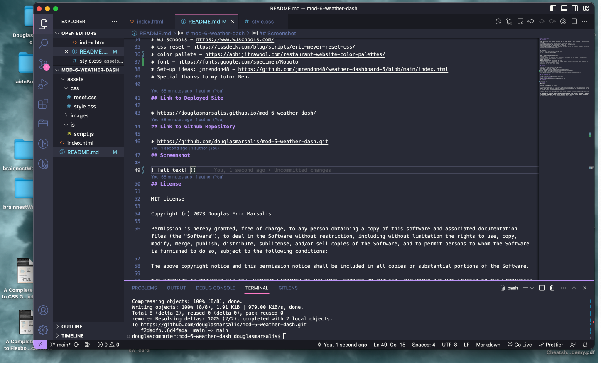

# mod-6-weather-dash

## Description 

* For this project, I will create an application that will enable the user to search for weather in various cities of their choosing.
* This application will feature updated HTML, CSS, JavaScript and Third Party APIs.
* The webpage and code will be clean and will have a responsive user interface that will adjust to multiple screen sizes.
* I will make sure that my code follows industry standards and is sourced correctly.
* I will review my code, look for problems and fix those isses.
* By building this webpage, it has helped me to learn information on HTML, CSS, JavaScript, Third Party APIs, GIT, GitHub, READme markdown information, and Deployment.

## User Story

AS A traveler 
I WANT to see the weather outlook for multiple cities
SO THAT I can plan a trip accordingly.

## Acceptance Criteria

GIVEN a weather dashboard with form inputs
WHEN I search for a city
THEN I am presented with current and future conditions for that city and that city is added to the search history
WHEN I view current weather conditions for that city
THEN I am presented with the city name, the date, an icon representation of weather conditions, the temperature, the humidity, and the the wind speed
WHEN I view future weather conditions for that city
THEN I am presented with a 5-day forecast that displays the date, an icon representation of weather conditions, the temperature, the wind speed, and the humidity
WHEN I click on a city in the search history
THEN I am again presented with current and future conditions for that city

## Sources

* Weather API - https://openweathermap.org/forecast5 
* mdn web docs - https://developer.mozilla.org/en-US/docs/Web/API 
* w3 schools - https://www.w3schools.com/
* css reset - https://cssdeck.com/blog/scripts/eric-meyer-reset-css/ 
* color pallete - https://abhijitrawool.com/restaurant-website-color-palettes/
* font - https://fonts.google.com/specimen/Roboto  
* Set-up ideas: jmrendon48 - https://github.com/jmrendon48/weather-dashboard-6/blob/main/index.html
* How to create a history list: https://www.youtube.com/watch?v=IrQss691cdE  
* How to create local storage: https://blog.logrocket.com/localstorage-javascript-complete-guide/
* Special thanks to my tutor Ben.

## Link to Deployed Site

* https://douglasmarsalis.github.io/mod-6-weather-dash/ 
## Link to Github Repository

* https://github.com/douglasmarsalis/mod-6-weather-dash.git 
## Screenshot

 
## License

MIT License

Copyright (c) 2023 Douglas Eric Marsalis

Permission is hereby granted, free of charge, to any person obtaining a copy of this software and associated documentation files (the "Software"), to deal in the Software without restriction, including without limitation the rights to use, copy, modify, merge, publish, distribute, sublicense, and/or sell copies of the Software, and to permit persons to whom the Software is furnished to do so, subject to the following conditions:

The above copyright notice and this permission notice shall be included in all copies or substantial portions of the Software.

THE SOFTWARE IS PROVIDED "AS IS", WITHOUT WARRANTY OF ANY KIND, EXPRESS OR IMPLIED, INCLUDING BUT NOT LIMITED TO THE WARRANTIES OF MERCHANTABILITY, FITNESS FOR A PARTICULAR PURPOSE AND NONINFRINGEMENT. IN NO EVENT SHALL THE AUTHORS OR COPYRIGHT HOLDERS BE LIABLE FOR ANY CLAIM, DAMAGES OR OTHER LIABILITY, WHETHER IN AN ACTION OF CONTRACT, TORT OR OTHERWISE, ARISING FROM, OUT OF OR IN CONNECTION WITH THE SOFTWARE OR THE USE OR OTHER DEALINGS IN THE SOFTWARE.

